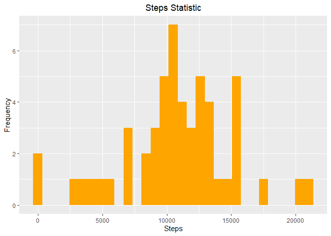

Before running the following code, it need to:
(1) install the three packages: ggplot2, dplyr, Hmisc
(2) set work space to a folder which contains this file and data file: "activity.csv"
## Loading and preprocessing the data
Firstly, we need to involve required packages


Then read the CSV data

```r
activityData <- read.csv("activity.csv")
```
Then we preprocess the data

```r
cleanedData <- na.omit(activityData)
cleanedData$date <- as.Date(cleanedData$date)
```

## What is mean total number of steps taken per day?
Let's aggregate the data by a day

```r
stepsEachDay <- aggregate(steps ~ date, cleanedData, sum)
```
Then let's Plot statistic of steps

<!-- -->

The mean value of frequency of steps per day is 10766.19:

```
## [1] 10766.19
```
The median value of frequency of steps per day is 10765:

```
## [1] 10765
```
## What is the average daily activity pattern?
Firstly, let's aggregate the data by interval

```r
stepsByInterval <- aggregate(steps ~ interval, cleanedData, mean)
```
plot time series plot of the average number of steps taken
<!-- -->

The 5-minute interval that, on average, contains the maximum number of steps is 835:

```
## [1] 835
```
## Imputing missing values
Calculate the number of NA

```
## [1] 2304
```
use Package named: Hmisc to add mean of eliminating NA to fill the NA value

```r
prepareFilledNAData <- activityData
prepareFilledNAData$steps <- impute(activityData$steps, fun=mean)
```
aggregate the data by a day

```r
stepsEachDayWithFilledNA <- aggregate(steps ~ date, prepareFilledNAData, sum)
```

<!-- -->

After filling the NA, the mean value of frequency of steps per day: 10766.19

```
## [1] 10766.19
```
After filling the NA, the median value of frequency of steps per day: 10765

```
## [1] 10765
```
## Are there differences in activity patterns between weekdays and weekends?
Preprocessing the date:

```r
prepareFilledNAData$date <- as.Date(prepareFilledNAData$date)
prepareFilledNAData$weekday <- weekdays(prepareFilledNAData$date)

prepareFilledNAData$dayType[prepareFilledNAData$weekday %in% c('Monday','Tuesday', 'Wednesday', 'Thursday', 'Friday')] <- "Weekday"
prepareFilledNAData$dayType[prepareFilledNAData$weekday %in% c('Saturday','Sunday')] <- "Weekend"

prepareFilledNAData$dayType <- as.factor(prepareFilledNAData$dayType)
```
aggregate by interval for weekday and weekend

```r
prepareFilledNADataByInterval <- aggregate(steps ~ interval + dayType, data=prepareFilledNAData, mean)
```
plot time series Of average steps By interval accross weekdays and weekends
<!-- -->
